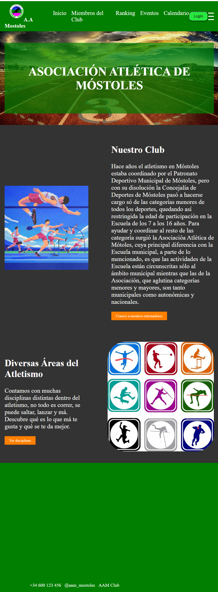
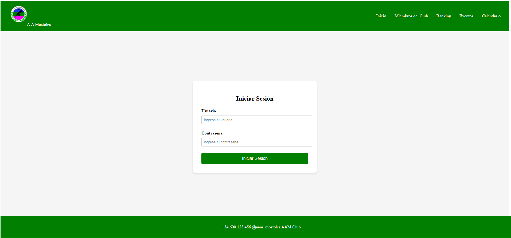
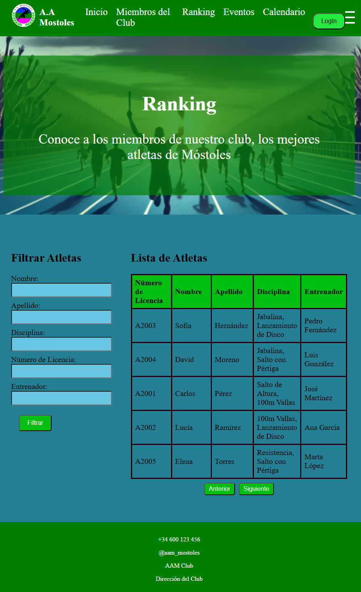
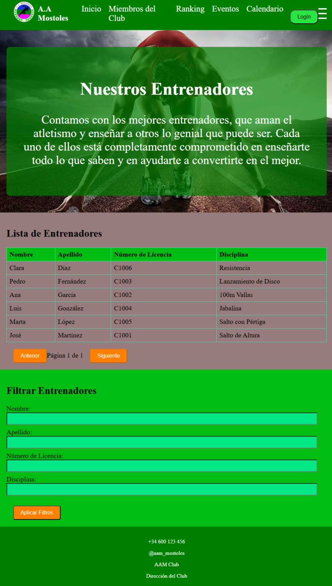
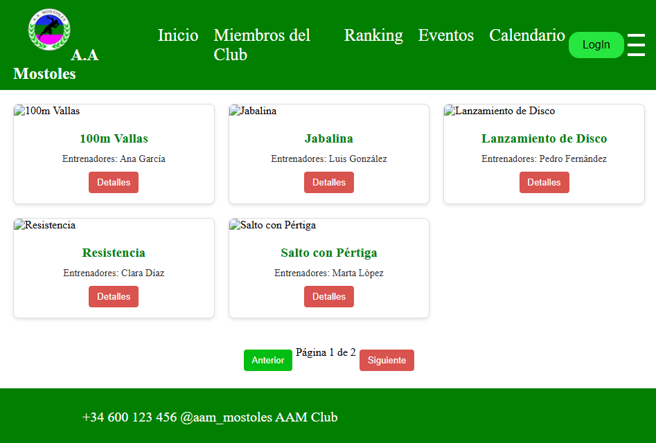
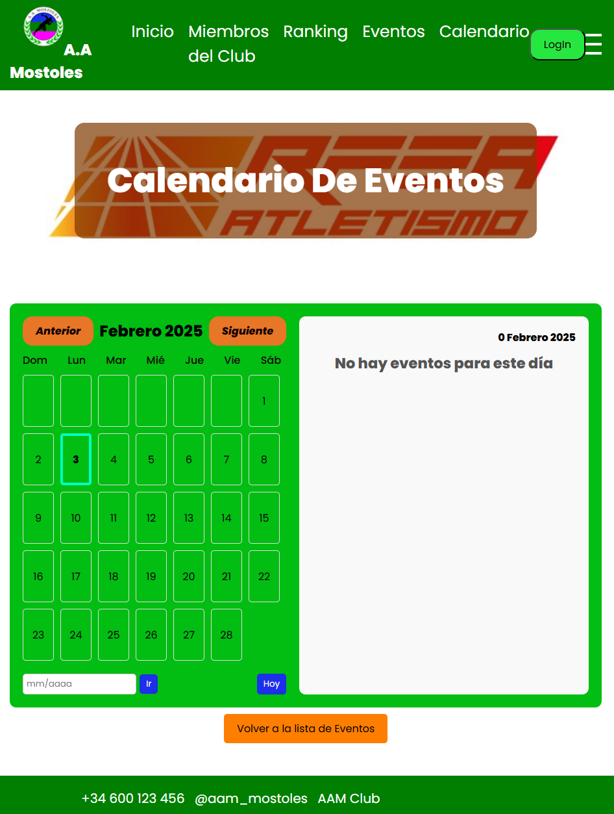
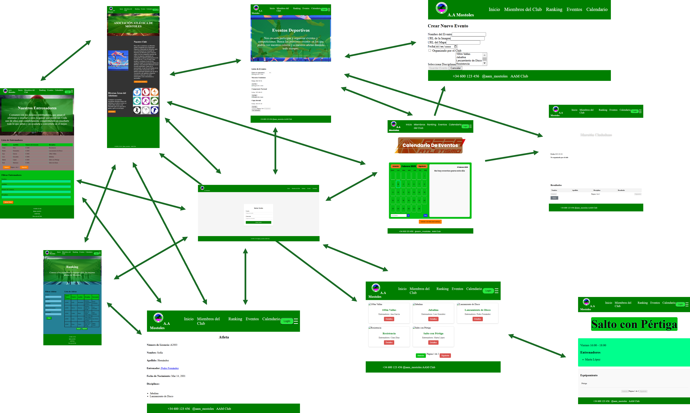
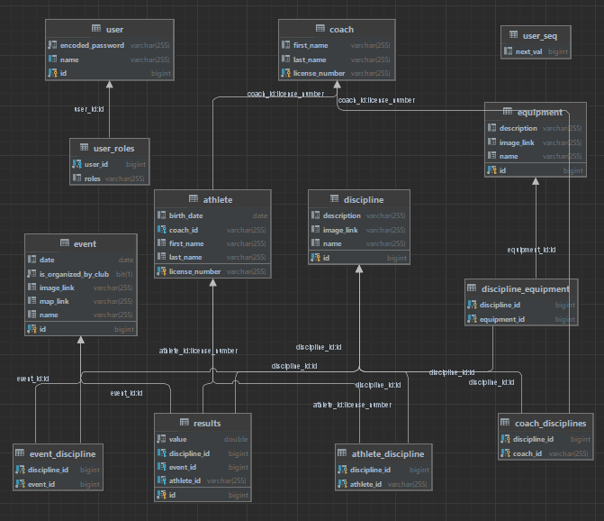
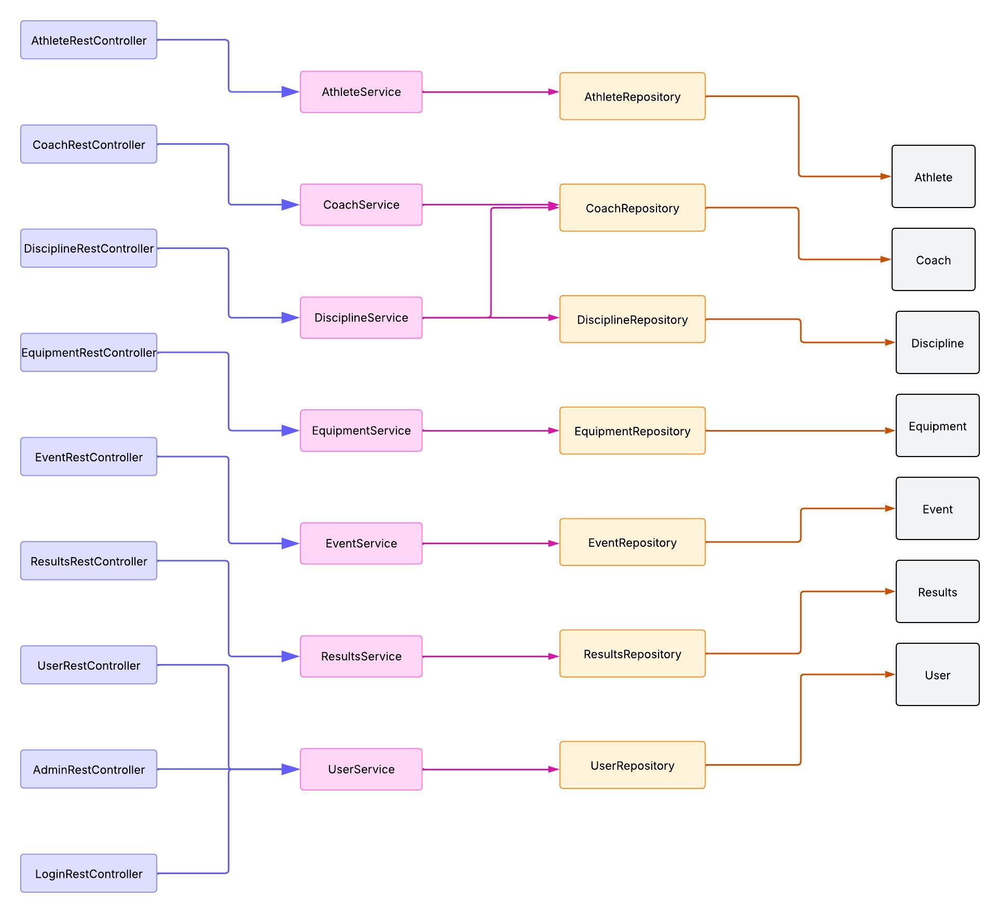
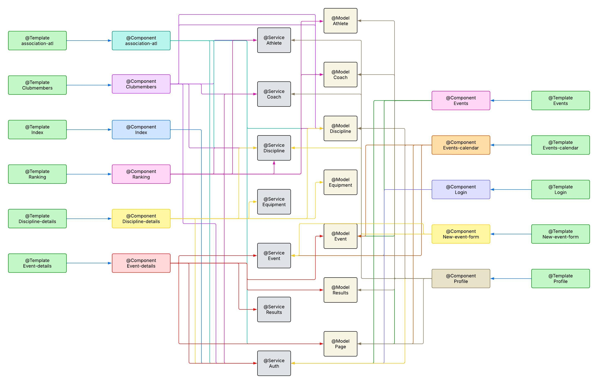

# Documentación del Proyecto TFG WebApp

# Fase 1

## 📌 Introducción
TFG WebApp es una aplicación desarrollada en Angular y Spring Boot para la gestión de eventos deportivos. La aplicación está contenida en Docker y utiliza MySQL como base de datos.

## 📷 Capturas de Pantalla
Se incluyen capturas de pantalla de las principales páginas de la aplicación, con una breve descripción de cada una.

- **Inicio**: Pantalla De Inicio con información basica del club y acceso a las demás pantallas

- **Login**: Pantalla de autenticación de usuarios.

- **Ranking**: Interfaz con un listado de atletas y los filtros sobre la lista.

- **Clubmembers**: Interfaz con un listado de los entrenadores del club, y los filtros aplicables sobre este.

- **Assosiation-atl**: Interfaz con el listado de disciplinas que se imparten en el club.

- **Calendar-Events**: Interfaz con el calendario de enventos interactivo.


## 🔗 Diagrama de Navegación
Se muestra la navegación entre las distintas páginas de la aplicación, con miniaturas de las capturas de pantalla.
## 

## 📊 Diagrama de Entidades de la Base de Datos
El siguiente diagrama muestra las entidades de la base de datos, sus atributos y relaciones. 

## 

## 🖥️ Diagrama de Clases del Backend
Se presenta un diagrama que describe la estructura del backend, diferenciando **@RestController, @Service, @Repository** y **Entidades**.
## 

## 🎨 Diagrama de Clases y Templates del Frontend
Se muestra la relación entre los componentes Angular, incluyendo **servicios, templates y relaciones padre-hijo**.
## 

## 🐳 Construcción de la Imagen Docker
Para construir la imagen Docker del backend, ejecutar el siguiente comando desde el directorio rais del proyecto:
```sh
docker build -t saac04/backend:latest -f docker/Dockerfile_backend .
```
Esto crea la imagen saac04/backend:latest en docker.

## 🚀 Ejecución de la Aplicación con Docker Compose
Para ejecutar la aplicación con Docker Compose, ejecutamos el siguiente código desde el directorio rais:
```sh
cd docker
docker-compose up -d
```
Esto inicia los contenedores del backend y la base de datos MySQL.
Una vez iniciado el contenedor la aplicación estara disponible en la url
```
https://localhost:443
```

## 🎥 Vídeo Demostrativo
Se ha subido un vídeo a YouTube mostrando las funcionalidades de la aplicación. Puedes verlo aquí: [Enlace al vídeo](https://www.youtube.com/watch?v=OJED6QcOsPE).

# Fase 2

## 🔄 Automatización con CI/CD
La aplicación cuenta con un sistema de **Integración y Entrega Continua (CI/CD)** utilizando GitHub Actions. A continuación, se detallan las tareas automáticas y la gestión de artefactos.

### 🚀 Tareas Automáticas
- **Integración Continua (CI)**:
    - Ejecuta pruebas de API REST y pruebas E2E en cada pull request a `main`.
    - Asegura que el código pase las pruebas antes de ser fusionado a la rama principal.
- **Entrega Continua (CD)**:
    - Construye y sube la imagen Docker automáticamente al repositorio de Docker Hub cuando hay un commit en `main`.
    - Actualiza el contenedor de pruebas con la nueva imagen para la ejecución de tests.

### 📦 Almacenamiento de Artefactos
- **Imágenes Docker**: Se alojan en Docker Hub bajo el nombre `saac04/backend:latest`.
- **Resultados de Pruebas**: Los registros de las pruebas se almacenan en la sección **Actions** de GitHub.
- **Registros de Ejecución CI/CD**: Se pueden revisar en la pestaña **Actions** del repositorio en GitHub, donde se almacenan logs de compilación, pruebas y despliegue.

Esto garantiza que cualquier cambio en el código se valide automáticamente y que las imágenes Docker se mantengan actualizadas con la última versión del backend.

